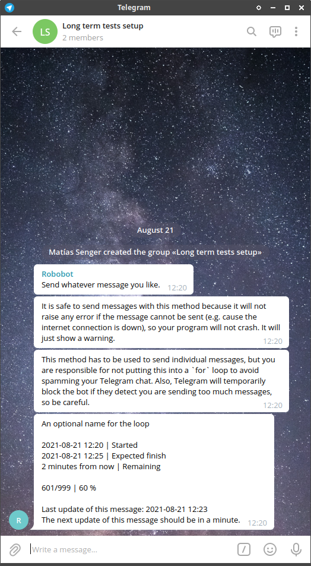
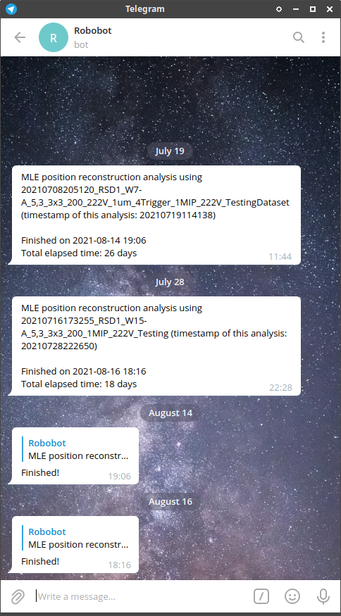

# progressreporting

Report the progress of long time lasting loops (e.g. ```for``` and ```while```) to your cell phone/computer using a Telegram bot.

Tested on Ubuntu, Windows and Raspberri Pi!

## Installation

```
pip3 install git+https://github.com/SengerM/progressreporting
```

## Usage examples

The following example shows the best way to use the ```TelegramProgressReporter``` to report the progress of a `for` loop. The ```with``` statement ensures that the initialization and finalization is done properly (you'll be properly notified in the beginning and the ending of the loop, despite there is an error or not). 

```Python
from progressreporting.TelegramProgressReporter import TelegramReporter
from data_processing_bureaucrat.Bureaucrat import TelegramReportingInformation # Here I hide the token of my bot. Never make it public.
from time import sleep

reporter = TelegramReporter(
	telegram_token = TelegramReportingInformation().token, # Here I store the token of my bot hidden, never make it public.
	telegram_chat_id = '-529438836',
)

reporter.send_message('Send whatever message you like.')
reporter.send_message('It is safe to send messages with this method because it will not raise any error if the message cannot be sent (e.g. cause the internet connection is down), so your program will not crash. It will just show a warning.')
reporter.send_message('This method has to be used to send individual messages, but you are responsible for not putting this into a `for` loop to avoid spamming your Telegram chat. Also, Telegram will temporarily block the bot if they detect you are sending too much messages, so be careful.')


MAX_K = 999
TOTAL_LOOP_TIME = 5*60 # Seconds, this is 5 minutes.
TOKEN = TelegramReportingInformation().token # Replace this line with the token of your bot.
CHAT_ID = TelegramReportingInformation().chat_id # Replace this line with the chat_id to which you want to send the information.

with reporter.report_for_loop(MAX_K,'An optional name for the loop') as reporter:
	for k in range(MAX_K):
		sleep(TOTAL_LOOP_TIME/MAX_K) # Here you would do some stuff, I will just sleep.
		reporter.update(1) # This line tells the reporter that one iteration has been completed, and automatically sends the updates once per minute to the Telegram chat.

reporter.send_message('Here you can send more messages.')

```

The program will automatically send messages to your Telegram chat, below some screenshots showing the previous example:




- Examples that lasted several days until completion:



### Notifying warnings

Sometimes some condition happens that is not enough to stop your program but you deserve to know about it. So it is not an error but a warning. The `TelegramProgressReporter` supports sending warnings, just proceed as follows:

```Python
from progressreporting.TelegramProgressReporter import TelegramProgressReporter
import time

MAX_K = 99999

with TelegramProgressReporter(MAX_K, 'token of your bot', 'ID of the chat to send the messages', 'This is a long loop') as reporter:
	for k in range(MAX_K):
		print(k)
		time.sleep(0.01)
		if k == 1111:
			reporter.warn('k is 1111! This is not too dangerous, but please pay attention.')
		reporter.update(1)
```

The `warn` method will send a new message notifying the warning. Don't worry if the `warn` method is called thousands of times per second. If this happens, there is an internal mechanism to register all these warnings and send them all packed together to the chat in a single compact message, to avoid spamming. The time after which warnings are collected and sent is specified by `minimum_warn_time_seconds` when creating the `TelegramProgressReporter` object, and by default is 5 minutes.

### Further examples

See the [examples directory](examples) for further examples.

## Error handling

The ```TelegramProgressReporter``` raises no errors at all. Consider, for example, that you started yesterday a loop that will last until tomorrow, and today you lost the internet connection for 10 minutes and the updates cannot be sent to your Telegram bot. You don't want the program to crash because of this stupidity. You don't have to worry because the only thing that ```TelegramProgressReporter``` will do is to display a warning, but the program will continue to run. When the connection is restored so it will the reporting.

## Creating a bot

To create a Telegram bot you can follow any of the tutorials that are around. To get the **chat ID** just talk to your bot, say "Hi", and then go to ```https://api.telegram.org/bot<YourBOTToken>/getUpdates```.
