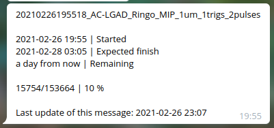
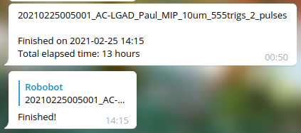
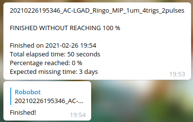

# progressreporting

Report the progress of long time lasting loops (e.g. ```for``` and ```while```) to your cell phone/computer using a Telegram bot.

Tested on Ubuntu, Windows and Raspberri Pi!

## Installation

```
pip3 install git+https://github.com/SengerM/progressreporting
```

## Usage example

The following example shows the best way to use the ```TelegramProgressReporter``` to report the progress of a loop. The ```with``` statement ensures that the inizialization and finalization is done properly (you'll be properly notified in the begining and the ending of the loop, despite there is an error or not). 

```Python
from progressreporting.TelegramProgressReporter import TelegramProgressReporter
import time

MAX_K = 99999

with TelegramProgressReporter(MAX_K, 'token of your bot', 'ID of the chat to send the messages', 'This is a long loop') as reporter:
	for k in range(MAX_K):
		print(k)
		time.sleep(0.01)
		reporter.update(1)
```

The program will automatically send messages to your Telegram chat, below some examples:

- Loop in progress. It sends a single message that is updated each time ```reporter.update(count)``` is called.



- Loop completed. It sends a new message to notify it was completed.



- Loop finished but without reaching 100 % (e.g. because of an error in your code or some problem). It sends a new message to notify and in the original message it reports that it did not reach 100 %.s



### Forcing the report

The process of sending a message to Telegram is relatively slow, it takes about 100-600 milli seconds. If you have a loop which takes less time in each iteration you don't want to make your program slower just because of the reporting messages. Thus, by default the ```TelegramProgressReporter``` will report every 60 seconds (you can change this time using the argument ```miminum_update_time_seconds```). If for some reason you want to force the report you can use the ```report``` method:

```Python
from progressreporting.TelegramProgressReporter import TelegramProgressReporter
import time

BOT_TOKEN = 'Token of your bot'
CHAT_ID = 'ID of the chat to which you want to send the updates'

MAX_K = 44444
with TelegramProgressReporter(MAX_K, BOT_TOKEN, CHAT_ID, 'With session') as reporter:
	for k in range(MAX_K):
		print(k)
		time.sleep(.01)
		reporter.update(1) # This will not report every time it is called, only after 60 s have passed since the last report.
		if 4444 < k < 5555: 
			reporter.report() # This will force a report to Telegram. Of course reporting in each loop will make it considerably slower so this is not recommended.
```
Note that it is always recomended to use the ```update``` method.

## Error handling

The ```TelegramProgressReporter``` raises no errors at all. Consider, for example, that you started yesterday a loop that will last until tomorrow, and today you lost the internet connection for 10 minutes and the updates cannot be sent to your Telegram bot. You don't want the program to crash because of this stupidity. You don't have to worry because the only thing that ```TelegramProgressReporter``` will do is to display a warning, but the program will continue to run. When the connection is restored so it will the reporting.

## Creating a bot

To create a Telegram bot you can follow any of the tutorials that are around. To get the **chat ID** just talk to your bot, say "Hi", and then go to ```https://api.telegram.org/bot<YourBOTToken>/getUpdates```.
